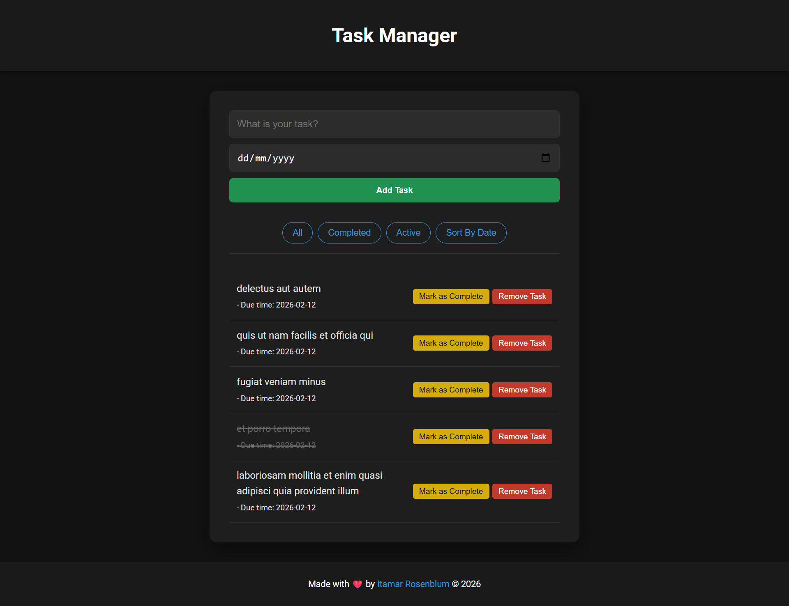

# HackerU - Task Manager Application Project

This is a solution to the Task Manager project challenge, part of the Full Stack Web Development curriculum at HackerU. This project focuses on managing tasks with persistent storage, API integration, and dynamic UI updates.

## Table of contents

- [Overview](#overview)
  - [The challenge](#the-challenge)
  - [Screenshot](#screenshot)
  - [Links](#links)
- [My process](#my-process)
  - [Built with](#built-with)
  - [What I learned](#what-i-learned)
  - [Continued development](#continued-development)

## Overview

### The challenge

Users should be able to:

- Add new tasks with a title and a due date.
- Toggle task completion status (marking as complete/active).
- Delete tasks from the list.
- Filter tasks based on their status (All, Completed, Active).
- Sort tasks chronologically by their due date.
- Persist data using LocalStorage so tasks remain after page refresh.
- Fetch initial data from an external API (`JSONPlaceholder`) on the first load.
- View the optimal layout depending on their device's screen size (Responsive Design).
- See hover and active states for all interactive buttons.

### Screenshot



### Links

- View Live Project: [text](url)

## My process

### Built with:

- Semantic HTML5 markup
- CSS3 Custom Properties (Variables) for Dark Mode theming
- CSS Flexbox for layout and alignment
- Mobile-first workflow and Responsive Design
- Vanilla JavaScript (ES6+) for logic and DOM manipulation
- Fetch API with Async/Await for external data retrieval

### What I learned

I improved my skills in handling arrays and asynchronous operations. A key learning point was implementing a clean sorting logic that doesn't mutate the original task array by using the Spread Operator:

```javascript
// Sorting tasks without mutating the original array
if (e.target.id === "sortDate") {
  const sortedTasks = [...tasks].sort((a, b) => {
    return new Date(a.dueDate) - new Date(b.dueDate);
  });
  rendertasks(sortedTasks);
}
```

I also practiced Event Delegation to handle clicks on dynamically generated elements (like delete and complete buttons) efficiently:

```javascript
// Using Event Delegation on the parent UL
document.querySelector("#taskList").addEventListener("click", (e) => {
  const clickedId = Number(e.target.dataset.id);

  if (e.target.classList.contains("remove-btn")) {
    const index = tasks.findIndex((task) => task.id === clickedId);
    tasks.splice(index, 1);
    saveTasks(); // Syncs with LocalStorage and Re-renders
  }
});
```

Writing clean JavaScript code, using utility functions and modular logic, helped me manage different features such as:

- Storage management: Implementing logic to remove the `tasks` key from LocalStorage when the array is empty, or update it with `JSON.stringify` when tasks exist. This ensures the storage remains clean and synchronized.
- Asynchronous Fetching: Using `try...catch` blocks for robust API calls and error handling, ensuring the app handles potential network issues gracefully.
- UI Feedback: Dynamic rendering based on filtered views (All/Active/Completed) and real-time updates to the DOM.

### Continued-development

I plan to continue deepening my understanding of Asynchronous JavaScript and working with more complex APIs. My next focus will be on learning React.js to manage application state more efficiently and explore component-based architecture.
